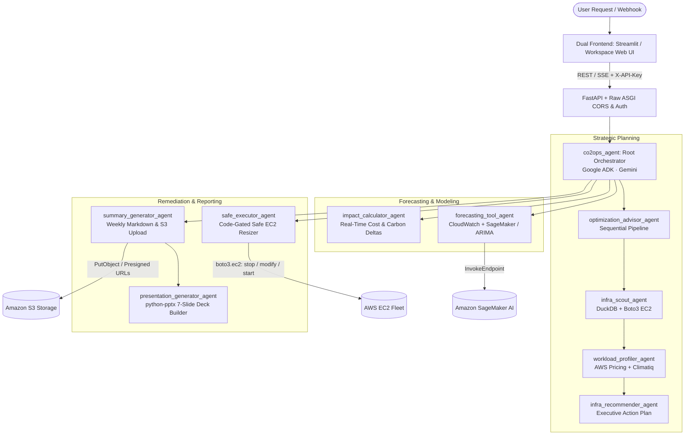

# CO2Ops — Autonomous AWS Cloud Sustainability & FinOps

<p align="center">
  
  
  
  
  
</p>

> *Cloud waste isn't just a cost problem — it's a carbon problem.*

Modern cloud teams over-provision Amazon EC2 instances "just to be safe." The consequence is silent capital burn and compounding, preventable carbon emissions. Manual audits are slow, infrequent, and rarely lead to automated remediation. 

**CO2Ops** is a production-grade, **hierarchical multi-agent AI system** built on the **Google Agent Development Kit (ADK)** and powered by **Google Gemini**. It continuously discovers, audits, forecasts, and remediates AWS cloud infrastructure waste — rightsizing compute fleets, driving Graviton adoption, generating board-ready executive slide decks, and validating every infrastructure modification against automated safety gates.

---

## 📌 Table of Contents

- [Key Capabilities](#-key-capabilities)
- [System Architecture](#-system-architecture)
- [Agent Hierarchy & Roles](#-agent-hierarchy--roles)
- [Dual User Interface](#-dual-user-interface)
- [Automated Data Pipeline](#-automated-data-pipeline)
- [Security & Authentication Model](#-security--authentication-model)
- [AWS Services & Integrations](#-aws-services--integrations)
- [Technology Stack](#-technology-stack)
- [Getting Started](#-getting-started)
- [Deployment Options](#-deployment-options)
- [Testing & Quality Assurance](#-testing--quality-assurance)
- [Environment Configuration](#-environment-configuration)
- [Project Directory Structure](#-project-directory-structure)
- [Roadmap & What's Next](#-roadmap--whats-next)
- [License](#-license)

---

## ⚡ Key Capabilities

```
+-----------------------------------------------------------------------------------------------+
|  📉 Automated Rightsizing      🌱 Graviton Migration       🔮 Predictive Safe Execution       |
|  Identifies idle EC2 fleets     Quantifies regional grid    7-day ARIMA & SageMaker AI load   |
|  via DuckDB SQL analytics       carbon deltas via Climatiq  forecasts prevent performance dip |
+-----------------------------------------------------------------------------------------------+
|  📑 Board-Ready Briefings      🛡️ Hardcoded Safety Gate     🔐 Enterprise Secret Mesh         |
|  Generates Matplotlib charts    In-code safety validation   3-tier secret lookup: Env Vars -> |
|  & 7-slide PowerPoint decks     prevents risky mutations    Secrets Manager -> SSM Parameters |
+-----------------------------------------------------------------------------------------------+
```

- **Autonomous Infrastructure Discovery**: Discovers EC2 instances in real time, computes utilization thresholds with in-memory DuckDB queries, and correlates metrics with live AWS Pricing lookups.
- **Dual Forecasting Engine**: Combines **Amazon SageMaker AI** serverless probabilistic endpoints (P10/P50/P90) with local **statsmodels ARIMA(1,0,0)** automatic fallbacks.
- **Code-Enforced Mutation Gates**: Safety criteria live directly in runtime Python code—not LLM system prompts—ensuring zero unauthorized mutations or prompt-injection bypasses.
- **Executive Reporting & Slide Generation**: Generates 4 high-resolution sustainability trend charts, compiles comprehensive weekly Markdown summaries, and builds ready-to-present PowerPoint (`.pptx`) decks stored securely in Amazon S3.

---

## 🏗️ System Architecture

CO2Ops employs a hierarchical orchestration model managed by a central Root Orchestrator delegating to specialized domain sub-agents:



### Agent Tree Layout

```text
                    ┌──────────────────────────────┐
                    │     Live AWS Console UI      │
                    │  (Streamlit + Workspace Web) │
                    └───────────────┬──────────────┘
                                    │  REST / SSE
                    ┌───────────────▼──────────────┐
                    │      co2ops_agent (Root)     │
                    │      Google ADK · Gemini     │
                    └───────────────┬──────────────┘
        ┌──────────────┬────────────┼────────────┬──────────────────┐
        ▼              ▼            ▼            ▼                  ▼
  optimization_   forecasting_  impact_      safe_executor_   summary_
  advisor_agent   tool_agent    calculator_  agent            generator_
  (Sequential)                  agent                         agent
        │                                                          │
        ▼                                                          ▼
  ┌─────────────────────────────────┐                  presentation_
  │  infra_scout_agent              │                  generator_agent
  │     ↓                           │                  (python-pptx)
  │  workload_profiler_agent        │
  │     ↓                           │
  │  infra_recommender_agent        │
  └─────────────────────────────────┘
```

---

## 🤖 Agent Hierarchy & Roles

### 🔎 `optimization_advisor_agent` — The Fleet Strategist
Implemented as an ADK `SequentialAgent` orchestrating a 3-stage deterministic relay:
1. **`infra_scout_agent`**: Queries running EC2 fleets via `boto3.client('ec2')` and enriches live inventory with 14-day CloudWatch telemetry. Loads records into an in-memory **DuckDB** instance for blazing-fast columnar filtering.
2. **`workload_profiler_agent`**: Flags underutilized instances (e.g. CPU < 30%, Memory < 40%). Calculates financial delta via live **AWS Pricing API** and computes carbon footprint via **Climatiq API**, prioritizing ARM-based **AWS Graviton** upgrades (m6g, c6g, t4g).
3. **`infra_recommender_agent`**: Synthesizes telemetry into prioritized, actionable migration proposals with transparent cost and carbon reduction projections.

---

### 📈 `forecasting_tool_agent` — The Predictive Oracle
Delivers 7-day statistical forecasts for CPU utilization, memory, and CO₂ emissions per instance:
1. Gathers 14-day metric time series from **Amazon CloudWatch** (`AWS/EC2` CPUUtilization, 86,400s periods).
2. Invokes an **Amazon SageMaker AI** serverless endpoint (when `SAGEMAKER_ENDPOINT_NAME` is configured) to generate probabilistic **P10 / P50 / P90** confidence intervals.
3. Automatically falls back to a local **statsmodels ARIMA(1,0,0)** model if SageMaker is not provisioned.
4. Always transparently indicates the operational inference engine used in the response.

---

### ⚖️ `impact_calculator_agent` — The Real-Time Comparator
Answers critical architectural trade-off questions (e.g., *"What if we moved from m5.xlarge to m6g.large in eu-west-1?"*):
- **Cost Differential**: Queries live AWS Price List APIs. Features a resilient local on-demand price index spanning 30+ instance types across `t3`, `t4g`, `m5`, `m6g`, `c5`, `c6g`, `r5`, and `r6g` families.
- **Emissions Differential**: Directly calls Climatiq's `/compute/v1/aws/instance/batch` endpoint. Accurately factors regional grid carbon intensity, instance TDP wattage, and applies a verified **30% efficiency bonus** for AWS Graviton silicon.

---

### 🛡️ `safe_executor_agent` — The Deterministic Gatekeeper
Guarantees operational reliability through rigorous, hardcoded runtime checks:
- **Code-Enforced Gate**: Before executing any mutation, the agent validates that 7-day forecasted average CPU is `< 30%` and memory is `< 40%`. Because this boundary is compiled in Python logic rather than LLM prompts, it is immune to prompt injection or hallucination.
- **Execution Workflow**:
  1. Stops the instance cleanly via `boto3` (`ec2.get_waiter('instance_stopped')`).
  2. Modifies the `instance_type` attribute via `ec2.modify_instance_attribute`.
  3. Restarts the instance safely (`ec2.get_waiter('instance_running')`).
- **Safety Overrides & Simulation**: A manual `force=True` flag is required to bypass safeguards. In development or demo sandboxes without live EC2 resources, it gracefully simulates the migration cycle.

---

### 📊 `summary_generator_agent` — The Executive Reporter
Compiles organization-wide sustainability scorecards:
- Uses **DuckDB** to aggregate weekly trends across all monitored instances and regions.
- Calls `optimization_advisor_agent` to extract regional rightsizing targets.
- Generates 4 production-quality **Matplotlib** visualizations:
  1. Carbon Emission Time Series
  2. CPU Utilization Distribution Bar
  3. CPU vs. Carbon Correlation Scatter
  4. Regional Underutilization Area Analysis
- Stores reports and visual assets in **Amazon S3** and generates 7-day pre-signed download URLs.

---

### 🖼️ `presentation_generator_agent` — The Deck Builder
Automatically builds polished, executive-ready 7-slide presentations using `python-pptx`:

| Slide | Section | Content |
|:-----:|:--------|:--------|
| **1** | Title | Hero branding, timestamp, and audit metadata |
| **2** | Executive Summary | AI-synthesized financial & sustainability wins |
| **3** | Forecast Overview | 7-day carbon emission trajectory |
| **4** | Regional Utilization | Underutilization breakdown across AWS regions |
| **5** | Top Recommendations | Prioritized instance rightsizing action items |
| **6** | Behavioral Insights | Compute efficiency vs. carbon footprint scatter plot |
| **7** | Next Steps & Roadmap | Actionable recommendations for FinOps leadership |

The presentation is automatically uploaded to **Amazon S3** with pre-signed download links embedded directly into the chat response.

---

## 🖥️ Dual User Interface

CO2Ops provides two purpose-built interfaces to cater to different operational personas:

### 1. Enterprise Minimalist Workspace (Nginx + Vanilla Web Stack)
- Sleek, high-contrast AWS Yellow & Charcoal terminal theme.
- Displays live agent routing badges (`Root`, `Forecaster`, `Advisor`, `Executor`, `Reporter`).
- Instant suggested prompts, execution status indicators, and clean Markdown rendering.
- Deployed as a lightweight static service on **AWS App Runner** or S3/CloudFront.

### 2. Streamlit Analytics Studio (`Frontend/app.py`)
- Python-driven interactive dashboard running on port `8501`.
- Built-in data exploration, interactive charts, and manual simulation triggers.

---

## 🔄 Automated Data Pipeline

A serverless AWS SAM application (`aws_lambda/daily_data_snapshot.py`) runs scheduled daily snapshots via **Amazon EventBridge**:

```
[Amazon EventBridge Cron (Midnight UTC)] 
              │
              ▼
    [AWS Lambda Function]
              │
              ├──> boto3: DescribeInstances & GetMetricData (CloudWatch)
              │
              └──> s3://co2ops-aws-metrics/daily_snapshots/YYYY-MM-DD.json
```

---

## 🔒 Security & Authentication Model

> [!IMPORTANT]
> The backend wraps Google ADK's FastAPI application with a custom **Raw ASGI Security Layer** to enforce enterprise authorization and secure browser communications.

- **API Authentication**: The custom ASGI middleware mandates `X-API-Key` verification across all stateful and mutation endpoints (`/run`, `/apps`, etc.).
- **Unbypassable ASGI CORS**: Injects strict `Access-Control-Allow-Origin` headers even on unhandled runtime 500 errors, ensuring web consoles receive detailed backend diagnostics rather than opaque CORS network drops.
- **3-Tier Credential Resolution**:
  ```text
  1. Local Environment Variables (.env)
       └──> 2. AWS Secrets Manager (GEMINI_API_KEY, CLIMATIQ_API_KEY)
              └──> 3. AWS SSM Parameter Store (Fallback)
  ```

---

## ☁️ AWS Services & Integrations

| AWS Service | Architectural Role |
|:------------|:-------------------|
| **Amazon EC2** | Live instance fleet discovery, telemetry collection, and safe stopping/resizing/restarting |
| **Amazon CloudWatch** | High-resolution historical metrics extraction (`CPUUtilization`, 14-day history) |
| **AWS Pricing API** | Dynamic real-time lookups for regional on-demand instance pricing |
| **Amazon S3** | Durable storage for daily JSON snapshots, generated charts, and `.pptx` presentations |
| **AWS Secrets Manager** | Encrypted key-value storage for Gemini API and Climatiq credentials |
| **AWS Systems Manager** | Parameter Store configuration fallback |
| **Amazon SageMaker AI** | Serverless inference endpoint hosting probabilistic ARIMA/linear trend models |
| **Amazon ECR** | Container image registry for backend (`co2ops-backend`) and frontend services |
| **AWS App Runner** | Managed production hosting with autoscaling, HTTPS termination, and health checks |
| **Amazon EventBridge** | Serverless cron scheduling for automated Lambda data pipelines |
| **AWS IAM** | Granular least-privilege execution roles (`CO2OpsExecutionRole`) |

---

## 🛠️ Technology Stack

```
AI & Multi-Agent Framework  ───  Google Agent Development Kit (ADK) >= 2.9.0
Core LLM Model              ───  Google Gemini (3.5 Flash / configurable via GEMINI_MODEL)
AWS Cloud SDK               ───  Boto3 >= 1.34.0 (EC2, CloudWatch, S3, SageMaker, Secrets Manager)
Data & SQL Analytics        ───  DuckDB >= 1.1.0, Pandas >= 2.2.0, NumPy >= 1.26.0
Forecasting & Statistics    ───  Statsmodels >= 0.14.0 (ARIMA), SciPy >= 1.13.0
External Carbon API         ───  Climatiq AWS Compute API v1
Visualization & Reporting   ───  Matplotlib >= 3.8.0, python-pptx >= 1.0.2
Backend API & Web Server    ───  FastAPI >= 0.110.0, Uvicorn >= 0.30.0, Raw ASGI Middleware
Frontend Interfaces         ───  Streamlit >= 1.35.0 & Nginx HTML5/JS Workspace Console
```

---

## 🚀 Getting Started

### Prerequisites

- **Python**: Version `3.12+`
- **Docker & Docker Compose**: For local containerized execution
- **Google Gemini API Key**: Obtainable from [Google AI Studio](https://aistudio.google.com/)
- **Climatiq API Key**: Obtainable from [Climatiq.io](https://www.climatiq.io/)
- **AWS Account**: With permissions for EC2, CloudWatch, S3, and Pricing

### Local Setup

1. **Clone the Repository:**
   ```bash
   git clone https://github.com/Hackmaass/CO2_Ops.git
   cd CO2_Ops
   ```

2. **Configure Environment Variables:**
   ```bash
   cp .env.example .env
   ```
   Populate `.env` with your credentials:
   ```ini
   GEMINI_API_KEY=your_gemini_api_key
   CLIMATIQ_API_KEY=your_climatiq_api_key
   CO2OPS_API_KEY=your_secure_shared_api_key
   AWS_DEFAULT_REGION=us-east-1
   AWS_ACCESS_KEY_ID=your_aws_key
   AWS_SECRET_ACCESS_KEY=your_aws_secret
   ```

3. **Launch with Docker Compose:**
   ```bash
   docker compose up --build
   ```
   - **Backend API**: `http://localhost:8080`
   - **Analytics Studio (Streamlit)**: `http://localhost:8501`

---

## 🚢 Deployment Options

### Option 1: AWS App Runner (Recommended for Production)

Deploy with the automated one-click scripts:

```powershell
# Windows PowerShell
./deploy_aws.ps1
```

```bash
# Linux / macOS
chmod +x deploy_aws.sh && ./deploy_aws.sh
```

These scripts automate:
1. Docker image builds for backend and frontend.
2. Authenticating and pushing images to **Amazon ECR**.
3. S3 bucket provisioning (`co2ops-sustainability-<account-id>`).
4. Creating or updating AWS App Runner services.

For full manual instructions, refer to [DEPLOY_TO_AWS_STEP_BY_STEP.md](file:///d:/Projects/CO2Ops/DEPLOY_TO_AWS_STEP_BY_STEP.md).

### Option 2: AWS ECS Fargate

For enterprise deployments requiring Application Load Balancer (ALB) integration and private VPC peering, see [AWS_DEPLOYMENT_PLAN.md](file:///d:/Projects/CO2Ops/AWS_DEPLOYMENT_PLAN.md).

---

## 🧪 Testing & Quality Assurance

CO2Ops features an extensive unit and integration test suite covering mocked AWS APIs, safety boundaries, and agent orchestration:

```bash
# Run the complete test suite
pytest tests/ -v
```

### Test Suite Breakdown

| Test File | Validation Focus |
|:----------|:-----------------|
| [`test_aws_executor.py`](file:///d:/Projects/CO2Ops/tests/test_aws_executor.py) | Verifies the code-enforced safety gate, including threshold blocks and `force=True` overrides |
| [`test_sagemaker_forecaster.py`](file:///d:/Projects/CO2Ops/tests/test_sagemaker_forecaster.py) | Tests SageMaker endpoint invocation and seamless fallback to local ARIMA |
| [`test_audit_pipeline.py`](file:///d:/Projects/CO2Ops/tests/test_audit_pipeline.py) | End-to-end simulation of the serverless audit pipeline with mocked boto3 calls |
| [`test_aws_pricing.py`](file:///d:/Projects/CO2Ops/tests/test_aws_pricing.py) | Live and cached pricing lookups across EC2 instance families |
| [`test_aws_carbon.py`](file:///d:/Projects/CO2Ops/tests/test_aws_carbon.py) | Climatiq emission queries and Graviton carbon efficiency calculations |
| [`test_root_agent.py`](file:///d:/Projects/CO2Ops/tests/test_root_agent.py) | Root agent sub-agent delegation and request routing |
| [`test_summary_and_presentation.py`](file:///d:/Projects/CO2Ops/tests/test_summary_and_presentation.py) | Matplotlib chart generation and PowerPoint `.pptx` rendering |
| [`test_secrets_access_manager.py`](file:///d:/Projects/CO2Ops/tests/test_secrets_access_manager.py) | Validates the 3-tier fallback resolution for secrets |

---

## ⚙️ Environment Configuration

| Variable | Required | Default | Description |
|:---------|:--------:|:-------:|:------------|
| `CO2OPS_API_KEY` | **Yes** | — | Secret token required in `X-API-Key` headers |
| `GEMINI_API_KEY` | **Yes** | — | Google Gemini API key |
| `CLIMATIQ_API_KEY` | **Yes** | — | Climatiq carbon calculation API token |
| `AWS_DEFAULT_REGION` | **Yes** | `us-east-1` | Target AWS region for auditing and operations |
| `AWS_ACCESS_KEY_ID` | **Yes** | — | IAM user credentials |
| `AWS_SECRET_ACCESS_KEY` | **Yes** | — | IAM user credentials |
| `GEMINI_MODEL` | No | `gemini-3.5-flash` | Gemini model variant powering agent decisions |
| `SAGEMAKER_ENDPOINT_NAME` | No | — | Optional SageMaker serverless forecasting endpoint |
| `ALLOWED_ORIGINS` | No | `*` | Allowed CORS origins for web clients |
| `AWS_METRICS_BUCKET` | No | `co2ops-aws-metrics` | S3 bucket destination for daily audit snapshots |
| `AWS_REPORTS_BUCKET` | No | `co2ops-aws-reports` | S3 bucket destination for generated reports and slides |

---

## 📂 Project Directory Structure

```text
CO2Ops/
├── co2ops_agent/                         # Core agent application package
│   ├── agent.py                          # Root orchestrator agent & sub-agent wiring
│   ├── server.py                         # FastAPI server with raw ASGI CORS & auth
│   ├── secrets_access_manager.py         # 3-tier secret resolution logic
│   ├── agents/                           # Specialized expert sub-agents
│   │   ├── optimization_advisor_agent/   # Sequential rightsizing pipeline
│   │   │   └── sub_agents/
│   │   │       ├── infra_scout_agent/    # DuckDB-powered EC2 discovery
│   │   │       ├── workload_profiler_agent/ # Utilization threshold & pricing
│   │   │       └── recommender_agent/    # Action plan formatting
│   │   ├── forecaster_agent/             # CloudWatch + SageMaker / ARIMA forecasting
│   │   ├── impact_calculator_agent/      # Live AWS Pricing & Climatiq comparisons
│   │   ├── safe_executor_agent/          # Forecast-gated EC2 modification
│   │   ├── summary_generator_agent/      # Weekly report aggregator & S3 uploader
│   │   └── presentation_generator_agent/ # 7-slide python-pptx presentation builder
│   └── sagemaker_model/                  # SageMaker serverless inference code
│       ├── inference.py                  # Endpoint entry point & linear extrapolation
│       └── deploy_endpoint.py            # Deployment automation script
├── Frontend/                             # User interface applications
│   ├── app.py                            # Streamlit interactive analytics studio
│   ├── workspace.html                    # Minimalist enterprise web console
│   ├── main.js                           # Frontend controller with agent routing
│   └── style.css                         # AWS Yellow & Charcoal styling
├── aws_lambda/                           # Serverless background pipeline
│   ├── daily_data_snapshot.py            # Daily EventBridge cron snapshot function
│   └── template.yaml                     # AWS SAM deployment template
├── tests/                                # Comprehensive test suite
├── docker-compose.yml                    # Local orchestration configuration
├── Dockerfile                            # Production container definition
├── deploy_aws.ps1 / deploy_aws.sh        # Automated AWS deployment scripts
└── DEPLOY_TO_AWS_STEP_BY_STEP.md         # Production deployment runbook
```

---

## 🗺️ Roadmap & What's Next

- [ ] **FinOps Anomaly Detection**: Real-time alerting on unexpected regional cost spikes and runaway workloads.
- [ ] **Security & Compliance Inspector**: Automated checking of security group exposures and unencrypted EBS volumes.
- [ ] **Automated Rollback Safeguards**: Auto-reverting resized instances if P95 latency increases within 60 minutes post-migration.
- [ ] **Multi-Cloud Federation**: Extending carbon and cost analytics to Google Cloud Platform (GCP) and Microsoft Azure.

---

## 📄 License

This project is licensed under the **Apache License 2.0**. See the [LICENSE](LICENSE) file for complete details.

<p align="center">
  <b>Built for greener, leaner, and more sustainable cloud infrastructure. 🌍</b>
</p>
